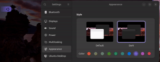

# sb_set_starship_colors.wezterm



The purpose of this plugin is to illustrate how the colors of features covered by [Starship](https://starship.rs/) can be customize from WezTerm.

DO NOT DIRECTLY APPLY THIS PLUGIN WITHOUT FIRST CUSTOMISING THE CONTENTS OF `plugin/set_starship_colors.lua` AS IT CAN CORRUPT YOUR `~/.config/starship.toml` FILE.

**NOTE:**

a. This plugin will only work in your WezTerm after:
   1. the [sb_show_system_color.wezterm](https://github.com/sunbearc22/sb_show_system_color.wezterm.git) plugin is used.
   2. `plugin/set_starship_colors.lua` is amended to suite the contents of your `~/.config/starship.toml` file.

b. It does not have a `apply_to_config()` method as it is unrelated to WezTerm's `Config` struct.

c. DO NOT run: `wezterm.plugin.require("https://github.com/sunbearc22/sb_set_starship_colors.wezterm.git")`.

## Installation

```
git clone https://github.com/sunbearc22/sb_set_starship_colors.wezterm.git
```

## Usage

```lua
local wezterm = require("wezterm")

local config = {}

if wezterm.config_builder then
    config = wezterm.config_builder()
end

-- Add these lines to use the plugin:
local repo = "file:///path/of/this/cloned/repository"
wezterm.plugin.require(repo)

return config
```

## Update

Press <kbd>CTRL</kbd><kbd>SHIFT</kbd><kbd>L</kbd> and run `wezterm.plugin.update_all()`.

## Removal

1. Press <kbd>CTRL</kbd><kbd>SHIFT</kbd><kbd>L</kbd> and run `wezterm.plugin.list()`.
2. Delete the `"plugin_dir"` directory of this plugin.

